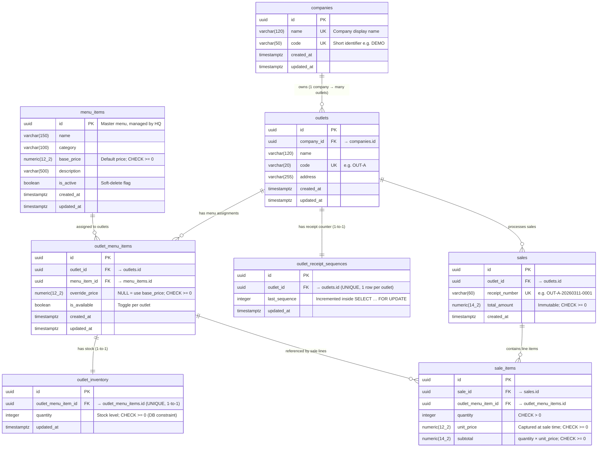

# Architecture Documentation

## 1. Entity Relationship Diagram (ERD)

> Rendered by Mermaid — visible natively on GitHub, GitLab, and VS Code with the **Markdown Preview Mermaid Support** extension.

---

### Key Design Decisions

| Decision                                                 | Rationale                                                                                                                                                              |
| -------------------------------------------------------- | ---------------------------------------------------------------------------------------------------------------------------------------------------------------------- |
| `outlet_menu_items` as junction table                    | Decouples master menu from per-outlet availability and price. HQ controls `menu_items`; outlets can only see what's assigned.                                          |
| `override_price` nullable on `outlet_menu_items`         | `NULL` means "use `menu_items.base_price`". A non-null value overrides per outlet with no duplication.                                                                 |
| `outlet_inventory` is 1-to-1 with `outlet_menu_items`    | Each assigned item has exactly one stock record per outlet. `CHECK quantity >= 0` at DB level prevents negative stock even on concurrent writes.                       |
| `outlet_receipt_sequences` with `SELECT … FOR UPDATE`    | One counter row per outlet, locked before increment. Guarantees monotonic, gap-free sequential receipt numbers under concurrent requests without a sequence per table. |
| Immutable `total_amount` and `unit_price` on sale tables | Prices captured at transaction time are never recalculated. Menu price changes don't corrupt historical receipts.                                                      |
| All monetary values as `NUMERIC`                         | Avoids IEEE-754 floating-point rounding errors for currency arithmetic.                                                                                                |

---

## 2. Scaling Plan (10 Outlets · 100,000 Transactions/Month)

> This section explains how the system can evolve to support this scale. The current implementation is intentionally simpler and does not need to fully implement all of the steps below.

### Capacity assumptions

- 10 outlets
- ~100,000 sales/month total
- Peak concurrent checkout bursts around meal windows

### Database scaling strategies

- Keep PostgreSQL as system of record.
- Add indexes for high-frequency queries:
  - `sales(outlet_id, created_at desc)`
  - `sale_items(sale_id)`
  - `outlet_inventory(outlet_menu_item_id)`
  - `outlet_menu_items(outlet_id, is_available)`
- Use transaction boundaries only where needed (`createSale`) to reduce lock time.
- Add connection pooling and set conservative max connections per API replica.
- Introduce table partitioning for `sales` and `sale_items` by time when data volume grows.
- Add read replicas for analytics and non-critical reads.
- Keep strict constraints (FK, CHECK, UNIQUE) in write-primary DB for correctness.

### Reporting performance considerations

- Move reporting queries away from OLTP write paths using:
  - read replicas, or
  - an asynchronous reporting read model fed by events.
- Pre-aggregate common metrics (daily outlet totals, top items) using scheduled jobs/materialized views.
- Cache expensive report responses with short TTL for dashboard traffic.
- Add pagination/time-window filters for all report endpoints that can grow over time.

### Infrastructure considerations

- Horizontal scale API replicas behind load balancer.
- Managed PostgreSQL with daily backups and PITR.
- Track p95 latency and DB lock wait metrics for sale transactions.
- Separate autoscaling policies for API (CPU/memory) and background workers.
- Centralized observability: structured logs, traces, and metrics dashboards.
- Multi-AZ deployment for API and database for availability.
- CI/CD gates for migration safety, smoke tests, and rollback validation.

### Architectural evolution

Suggested staged evolution path:

1. **Current**: modular monolith + single PostgreSQL primary.
2. **Near-term**: modular monolith + read replica + reporting optimizations.
3. **Growth**: split into grouped services (operations, commerce, insights) with contract versioning.
4. **Advanced**: event-driven reporting pipeline, stronger offline sync, and domain-specific scaling policies.

---

## 3. Microservices Evolution Strategy

### Current state

- Modular monolith with clear domain boundaries:
  - Menu and assignment
  - Inventory
  - Sales
  - Reporting

### Extraction path

1. Keep write-heavy sales + inventory together initially to preserve transaction consistency.
2. Extract reporting into an async read service fed by DB replicas or event stream.
3. Extract menu/catalog service when outlet count and menu complexity grow.

### Integration model

- API contracts versioned via OpenAPI.
- Event topics for eventual consistency flows (example: `sale.created`, `inventory.changed`).
- Idempotent consumers to handle retries.

### Data ownership target

- Sales service owns `sales`, `sale_items`, and receipt sequencing.
- Inventory service owns `outlet_inventory` state transitions.
- Catalog service owns `menu_items` and `outlet_menu_items` definitions.

---

## 4. Offline POS / KDS Sync Strategy

### A. How offline POS terminals sync sales to HQ on reconnect

#### Local offline write model

- POS writes sales to a local durable store (for example SQLite/IndexedDB) when internet is down.
- Every local sale gets:
  - `offlineSaleId` (UUID generated on terminal)
  - `terminalId`
  - `outletId`
  - `createdAtLocal`
  - `idempotencyKey` (stable across retries)
- Queue states: `pending`, `in_flight`, `synced`, `failed_conflict`.

#### Reconnect sync flow

1. POS detects connectivity recovery.
2. POS sends queued sales in chronological order to HQ sync endpoint.
3. HQ processes each item idempotently using `idempotencyKey`.
4. HQ responds per item with:
   - `accepted` + canonical `saleId` and `receiptNumber`, or
   - `rejected` + reason (for example insufficient stock).
5. POS marks queue records as `synced` or `failed_conflict`.
6. POS pulls latest inventory snapshot and recent sales from HQ to re-align local state.

#### Idempotency and duplicate protection

- If POS retries the same sale (timeout/network flap), HQ returns the already-created result for that `idempotencyKey`.
- This prevents double charging and duplicate receipts.

### B. How POS and KDS continue working during offline mode

#### Local outlet communication

- POS and KDS communicate over local network inside the outlet (LAN), not through HQ.
- POS emits local ticket events to KDS immediately after local sale capture.
- KDS keeps a local ticket store with statuses (`new`, `preparing`, `ready`, `served`).

#### Offline-first ticket lifecycle

1. Cashier creates sale on POS (stored locally).
2. POS sends local ticket to KDS with `offlineSaleId`.
3. KDS updates status locally and acknowledges to POS.
4. POS can still print receipts and display order progress while offline.

#### Reconnect reconciliation

- When HQ sync completes, POS maps `offlineSaleId` to HQ `saleId`/`receiptNumber`.
- KDS records can be backfilled with canonical HQ IDs for audit consistency.
- Any rejected sales are flagged for cashier action (void/retry/substitute).

### C. Conflict handling and safety rules

- Inventory remains authoritative at HQ.
- During sync, if stock is no longer sufficient:
  - HQ rejects the specific sale or line item with structured reason.
  - POS moves item to exception queue and asks cashier for resolution.
- All sync operations are append-only and auditable.

### D. Recovery and observability

- Local storage encrypted at rest on POS/KDS devices.
- UI shows sync state: `offline`, `syncing`, `synced`, `conflict`.
- Daily reconciliation report compares:
  - local accepted offline totals,
  - HQ committed totals,
  - unresolved conflict count.
